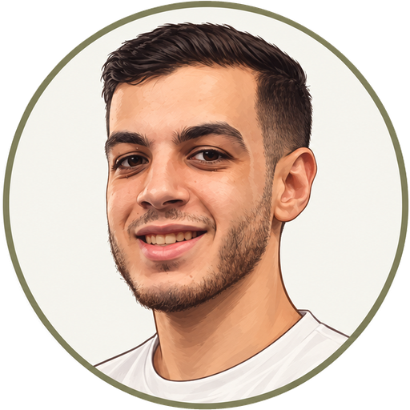

<h3><code>belal@github ~ $ echo "Hi, I'm Belal Aboseada"</code></h3>

Software Engineer · Tech Content Creator · Damanhur, Egypt

 
 

<!-- live contribution graph: real data, cells cascade in once and hold.
     regenerated daily by .github/workflows/update-profile-art.yml -->

<h3><code>belal@github ~ $ ./contributions.sh</code></h3>

 
 

<!-- ascii portrait (left) + neofetch card (right). 740x880 and 980x880 svgs,
     so widths 370 + 490 = 860 give equal heights and line up with the graph.
     portrait: python scripts/prep_photo.py <photo> && python scripts/make_ascii_svg.py
     card:     edit ROWS in scripts/make_info_card.py, then run it -->

<h3><code>belal@github ~ $ whoami</code></h3>

<table>
<tr>
<td valign="top"></td>
<td valign="top"></td>
</tr>
</table>

 
 

<h3><code>belal@github ~ $ ls ./projects</code></h3>

<table>
<tr>
<td><a href="https://mock--mate.vercel.app"><b>MockMate</b></a> AI interview coach · SalamHack</td>
<td><a href="https://madar.services/"><b>Madar</b></a> Vue · Tailwind · GSAP</td>
<td><a href="https://yum-dash.web.app/"><b>Yum-Dash</b></a> Food delivery e-commerce</td>
</tr>
<tr>
<td><a href="https://movix-tau-three.vercel.app"><b>Movix</b></a> Movies &amp; TV discovery · React</td>
<td><a href="https://github.com/BelalAboseada/NodeJs-Courses-Project"><b>Courses API</b></a> Node.js backend for a courses app</td>
<td><a href="https://github.com/BelalAboseada/Belal-Portfolio"><b>Portfolio</b></a> Next.js · TypeScript · GSAP</td>
</tr>
</table>

 
 

<h3><code>belal@github ~ $ ./links.sh</code></h3>

<b>Software Engineer · Tech Content Creator</b> Developer by day, creator by night.

 

 

