<!-- hero, in the portfolio's look (scripts/make_hero_svg.py) -->

<a href="https://belalaboseada.vercel.app/">
<picture>
  <source media="(max-width: 767px)" srcset="./hero-mobile.svg?v=1883525e">
  
</picture>
</a>

 
 

<!-- live contribution graph: real data, cells cascade in once and hold.
     regenerated daily by .github/workflows/update-profile-art.yml.
     phones (<= 767px) get the last 22 weeks with stacked stats. -->

<picture>
  <source media="(max-width: 767px)" srcset="./contrib-heatmap-mobile.svg">
  
</picture>

 
 

<!-- portrait (avatar types itself in as ascii, then fades to the image) + about card.
     desktop: side by side (whoami.svg). phones: stacked, bigger type (whoami-mobile.svg).
     rebuild: python scripts/fonts.py (once) && python scripts/make_avatar_svg.py && python scripts/make_info_card.py
              && python scripts/make_whoami_svg.py && python scripts/stamp_readme.py -->

<picture>
  <source media="(max-width: 767px)" srcset="./whoami-mobile.svg?v=9160063b">
  
</picture>

 
 

<!-- links: two narrow columns so the table fits a phone without scrolling -->

<table>
<tr><th>( WORK )</th><th>( CREATE )</th></tr>
<tr><td><a href="https://belalaboseada.vercel.app/">&nbsp;<b>Portfolio</b></a></td><td><a href="https://www.youtube.com/@belalaboseada">&nbsp;<b>YouTube</b></a></td></tr>
<tr><td><a href="mailto:belalaboseada@gmail.com">&nbsp;<b>Email</b></a></td><td><a href="https://www.tiktok.com/@Belalaboseada">&nbsp;<b>TikTok</b></a></td></tr>
<tr><td><a href="https://www.linkedin.com/in/belal-hesham">&nbsp;<b>LinkedIn</b></a></td><td><a href="https://www.instagram.com/belal_aboseada">&nbsp;<b>Instagram</b></a></td></tr>
<tr><td><a href="https://drive.google.com/file/d/1Ot_5t6ed1R2TANS3rw6u6mf6C7ct8OCl/view?usp=sharing">&nbsp;<b>CV</b></a></td><td><a href="https://www.facebook.com/belal.hesham.1848">&nbsp;<b>Facebook</b></a></td></tr>
</table>

 

<a href="mailto:belalaboseada@gmail.com">
<picture>
  <source media="(max-width: 767px)" srcset="./footer-mobile.svg?v=54a14e73">
  
</picture>
</a>

 
 

